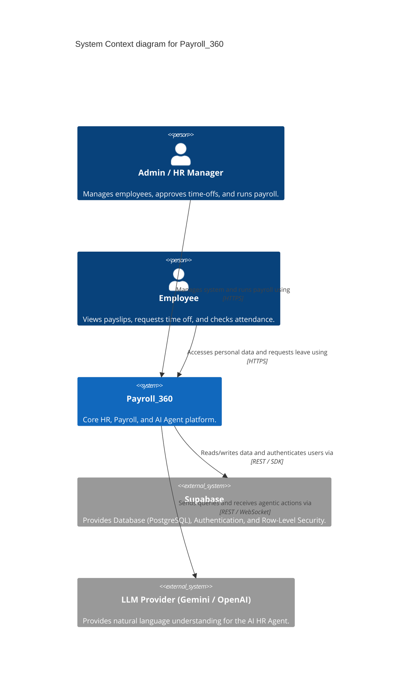
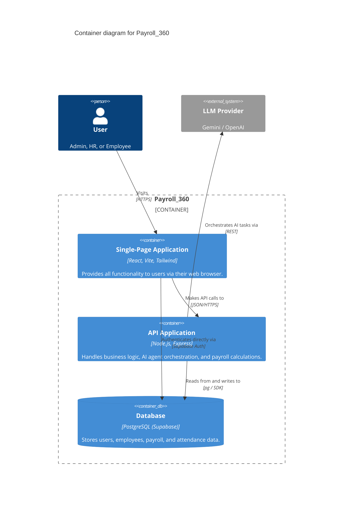
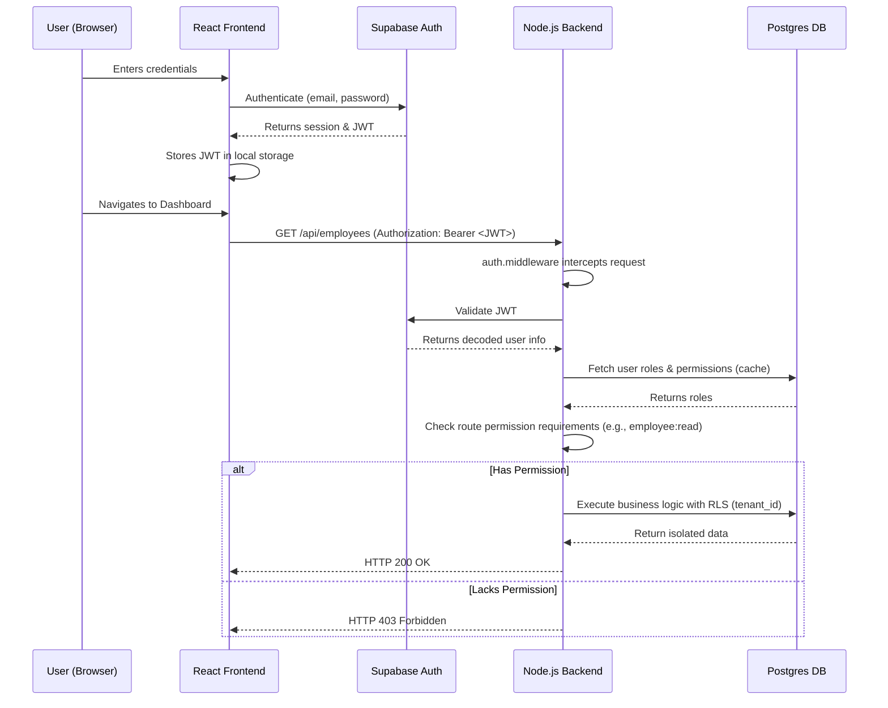
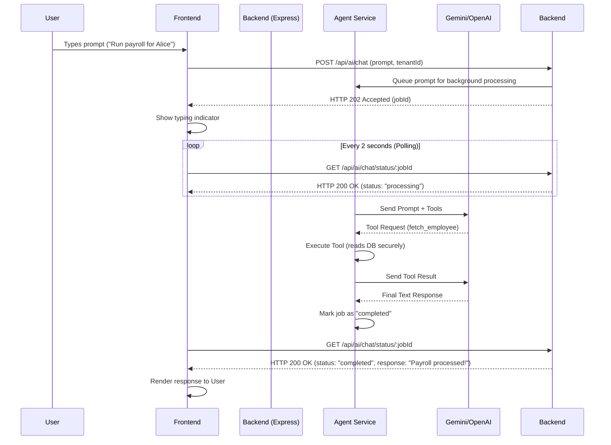
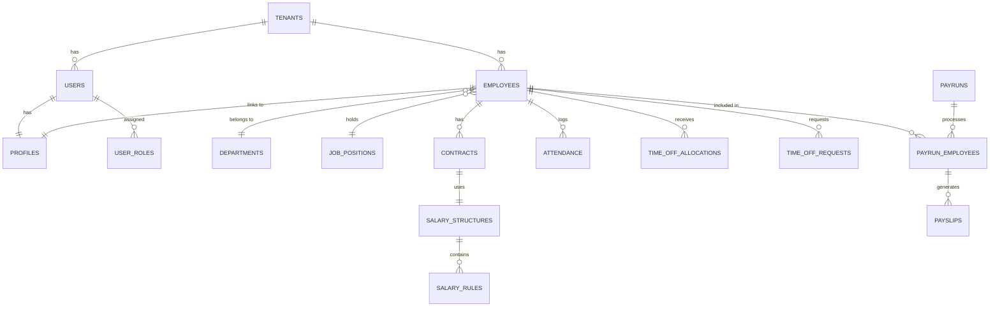

# Payroll_360: AI-Powered HR & Payroll Management System

Welcome to **Payroll_360**, a comprehensive, multi-tenant Human Resources and Payroll Management platform. It streamlines core HR operations—such as employee management, attendance tracking, and time-off requests—and features an advanced **AI Payroll Agent** capable of interacting with HR managers in natural language to orchestrate complex payroll calculations and reports.

---

## 🚀 Features

- **Multi-Tenant Architecture**: Securely manage multiple organizations within a single database instance using strict Row-Level Security (RLS).
- **Role-Based Access Control (RBAC)**: Fine-grained permissions (Admin, HR Manager, Payroll Admin, Employee) to ensure users only see and mutate what they are authorized to.
- **Dynamic Payroll Engine**: An advanced mathematical evaluation engine that processes dynamic Salary Rules (e.g., Basic Pay, HRA, PF) based on real-time attendance and contract data.
- **AI HR Assistant**: Integrated with Large Language Models (Gemini/OpenAI) to provide a conversational interface for running payroll, fetching insights, and analyzing salary structures.
- **Time Off & Attendance**: Automated tracking of Paid Time Off (PTO), Sick Leave, and daily attendance records with manager approval workflows.
- **Secure Document Viewer**: Embedded, non-downloadable PDF viewer for company policies (supports `<iframe>` integrations with dynamic headers).

---

## 🏗️ System Architecture

Payroll_360 follows a decoupled architecture, consisting of a React SPA (Frontend), a Node.js/Express API (Backend), and a Supabase PostgreSQL database.

### System Context Diagram



### Container Diagram



---

## 🔐 Security & Data Flow

### Authentication & Authorization

Identity is managed by Supabase Auth (JWT). Authorization is managed by the Node.js backend using a custom RBAC middleware (`requirePermission`).



---

## 🤖 AI Agent Integration Flow

The standout feature of Payroll_360 is the AI Payroll Agent. The agent interacts with the backend by executing predefined, heavily sandboxed "tools" (e.g., `fetch_salary_rules.js`, `fetch_employee.js`) instead of directly executing SQL, ensuring strict compliance with Tenant Isolation policies.



---

## 🧮 Payroll Engine Logic

The Payroll Engine (`src/services/payrollEngine.service.js`) dynamically computes net pay by evaluating a sequence of rules against an employee's context.

```mermaid
flowchart TD
    Start([Start Payroll Run]) --> FetchEmployees[Fetch active employees in Payrun]
    
    FetchEmployees --> Iterate[For Each Employee]
    
    Iterate --> FetchContract[Fetch Active Contract & Salary Structure]
    FetchContract --> FetchAttendance[Fetch Attendance & Time Off Data]
    
    FetchAttendance --> BaseSalary[Initialize Local Scope: Basic Salary, Days Worked]
    
    BaseSalary --> FetchRules[Fetch Salary Rules (ordered by sequence)]
    
    FetchRules --> EvaluateRule{Evaluate Condition}
    
    EvaluateRule --"True"--> CalcAmount[Calculate Amount (Fixed / Percentage / Code)]
    CalcAmount --> ApplyAmount[Add to Gross / Deductions]
    ApplyAmount --> NextRule[Next Rule]
    
    EvaluateRule --"False"--> NextRule
    
    NextRule --> MoreRules{More Rules?}
    MoreRules --"Yes"--> EvaluateRule
    
    MoreRules --"No"--> Finalize[Calculate Net Pay]
    Finalize --> StorePayslip[(Store in `payslips`)]
    
    StorePayslip --> MoreEmployees{More Employees?}
    MoreEmployees --"Yes"--> Iterate
    MoreEmployees --"No"--> Complete([Complete Payrun])
```

---

## 🗄️ Database Entity-Relationship Diagram (ERD)

The PostgreSQL database uses UUIDs, enforces Foreign Key constraints, and includes full Audit Trails (`created_at`, `updated_at`, `created_by`, `updated_by`).



---

## 🛠️ Tech Stack

**Frontend:**
- React 18, Vite
- Tailwind CSS
- React Router DOM
- Axios
- Lucide React (Icons)

**Backend:**
- Node.js, Express
- Supabase JS SDK (Database & Auth)
- Zod (Request Validation)
- Math.js (Payroll rule evaluation)
- LangChain / Google Vertex AI SDK (AI Agent)

**Database:**
- PostgreSQL (Supabase)
- Row-Level Security (RLS)

---

## 📖 Further Documentation
More detailed architectural insights can be found in the `/docs` directory:
- `docs/architecture/` - System, Data, and Security Architecture.
- `docs/backend/` - Node.js API logic and Engine rules.
- `docs/frontend/` - React UI component structure.
- `docs/integration/` - External LLM and API flow documentation.
