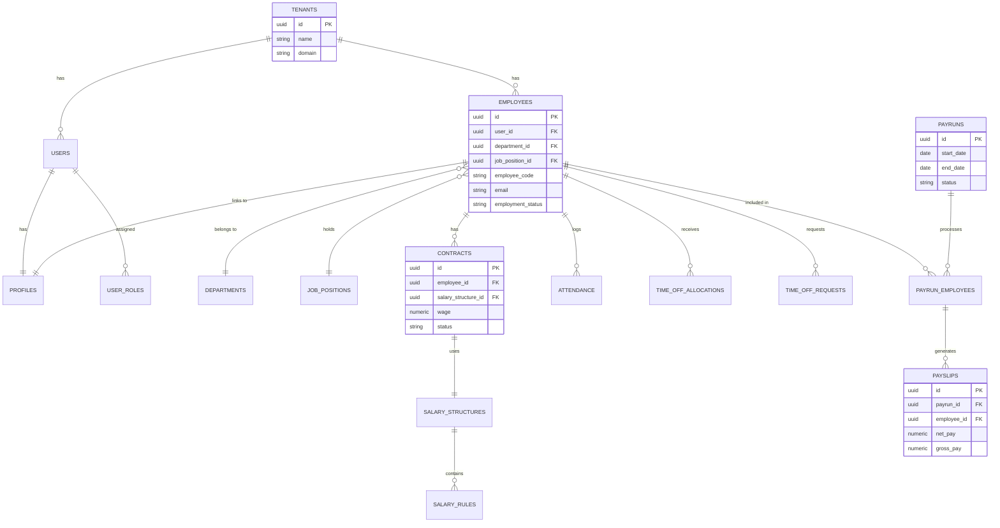

# Data Architecture

This document describes the core database design and Entity-Relationship architecture for Payroll_360. The application relies on PostgreSQL provided by Supabase.

## Entity-Relationship Diagram (ERD)

The following diagram highlights the key tables and their relationships across the HR, Time Off, and Payroll modules.

## Data Isolation (Multi-Tenancy)

Data isolation is strictly enforced to ensure that users belonging to one organization (Tenant) cannot access data from another.

1. **Tenant ID:** Every table in the system (except system-wide lookup tables) contains a `tenant_id` column.
2. **Row-Level Security (RLS):** Supabase RLS policies are applied at the database layer. Every query must pass through a policy that checks if the record's `tenant_id` matches the `tenant_id` of the authenticated user making the request.
3. **Application Layer Scope:** The Node.js backend implements an abstraction `withTenant(query, tenantId)` that automatically appends a `.eq('tenant_id', tenantId)` filter to all database queries to provide defense-in-depth against RLS misconfigurations.
