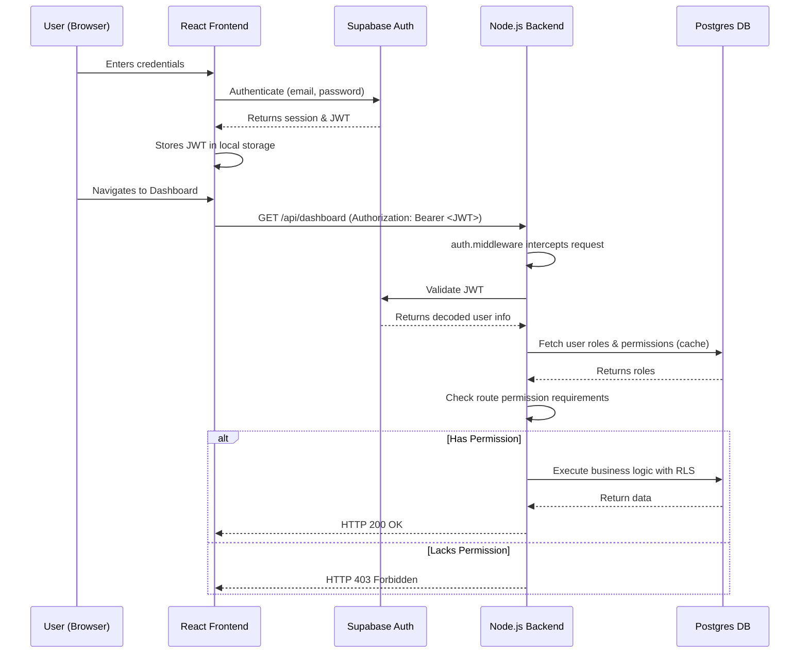

# Security Architecture

Payroll_360 implements a robust, token-based authentication and Role-Based Access Control (RBAC) authorization architecture.

## Authentication Flow

The system uses Supabase Auth for identity management, issuing secure JWTs (JSON Web Tokens) that are validated by the backend API.

## Role-Based Access Control (RBAC)

Every route in the Node.js backend is protected by the `requirePermission` middleware. The middleware ensures that the authenticated user possesses the specific fine-grained permissions required to perform an action.

### Roles and Permissions Matrix

| Role | Description | Key Permissions |
|------|-------------|-----------------|
| **`system_admin`** | Superuser with cross-tenant access (internal team). | All permissions. Can manage tenants and super-settings. |
| **`admin`** | Tenant administrator (Company Owner). | `user:manage`, `payroll:manage`, `settings:manage`. |
| **`hr_manager`** | Human Resources Manager. | `employee:create`, `employee:read`, `contract:manage`, `leave:approve`. |
| **`payroll_admin`** | Payroll Administrator. | `payroll:run`, `payroll:approve`, `payslip:view`. |
| **`employee`** | Standard Employee. | `employee:read_own`, `payslip:read_own`, `leave:request`. |

## Supabase Row-Level Security (RLS)

While the Node.js API enforces RBAC, Supabase RLS is enabled as a secondary defense layer directly on the database. RLS policies ensure that even if the API layer fails to properly scope a query, the database will strictly enforce:

1. A user can only read/write rows where `tenant_id == auth.jwt() -> 'app_metadata' -> 'tenant_id'`.
2. A standard employee can only read/write their own personal data (`user_id == auth.uid()`).
