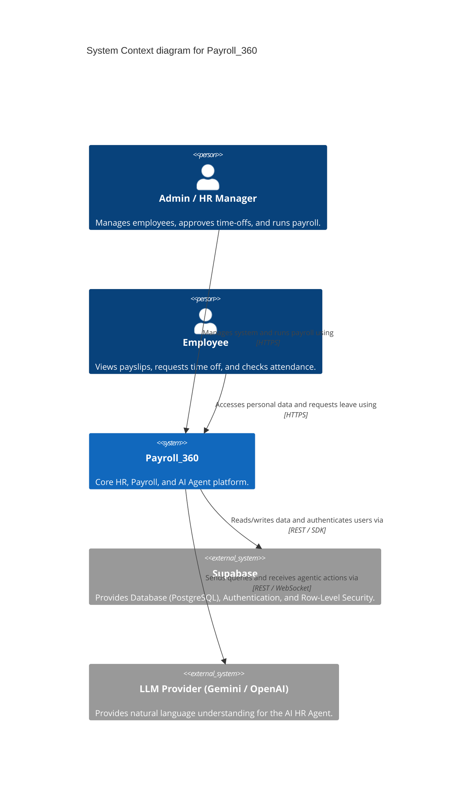
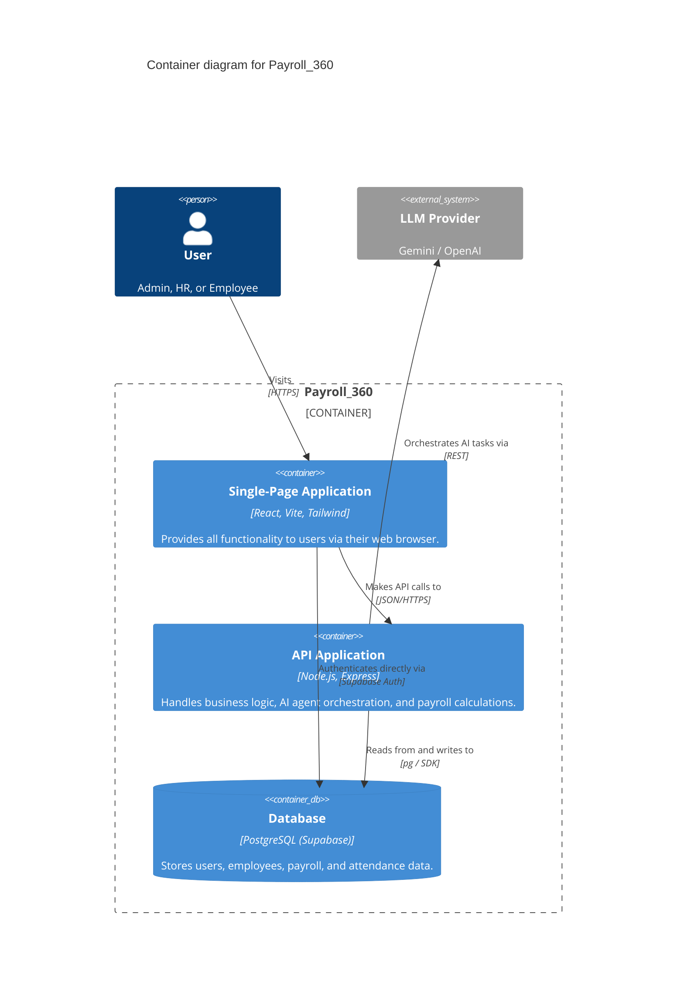

# System Architecture

This document describes the high-level architecture of **Payroll_360**, an AI-powered human resources and payroll management system.

## C4 Model: System Context Diagram

The system context diagram shows the overarching relationship between the users, the core Payroll_360 system, and external third-party services.

## C4 Model: Container Diagram

The container diagram breaks down the Payroll_360 system into its constituent applications and data stores.

## High-Level System Flow

1. **Authentication:** The user logs in via the React Frontend. The frontend authenticates directly with Supabase Auth to receive a JWT.
2. **Authorization:** The frontend includes the JWT in the `Authorization` header of REST API requests to the Node.js backend.
3. **Data Isolation (Multi-Tenancy & RBAC):** The backend verifies the JWT and enforces Row-Level Security (RLS) constraints and Role-Based Access Control before interacting with the PostgreSQL database.
4. **AI Agent Interaction:** When using the AI HR Assistant, the frontend sends a prompt to the backend. The backend delegates the prompt to an LLM provider alongside specific tooling functions (e.g., fetching employee data). The results are streamed back to the frontend.
